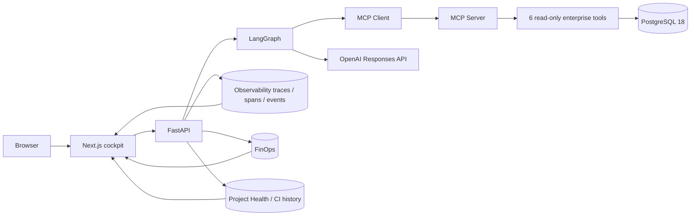
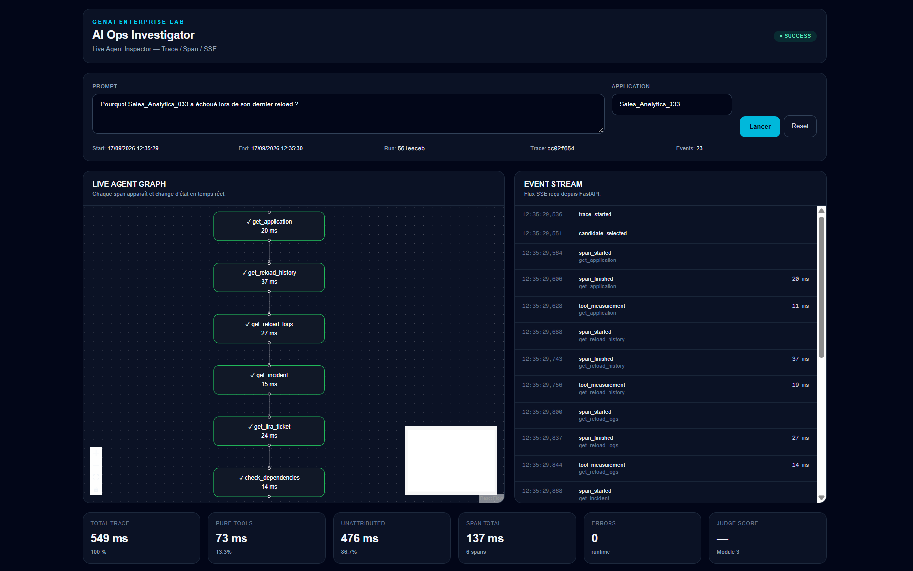
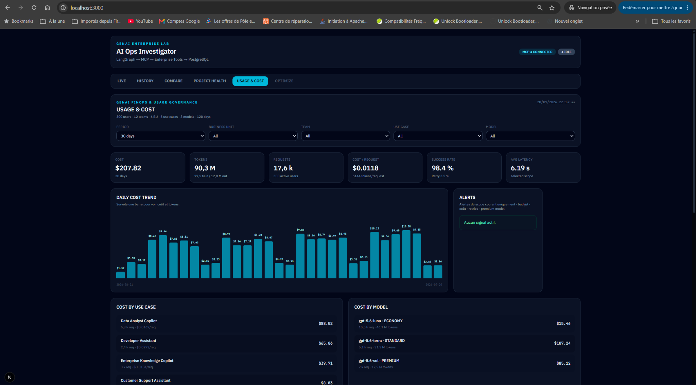
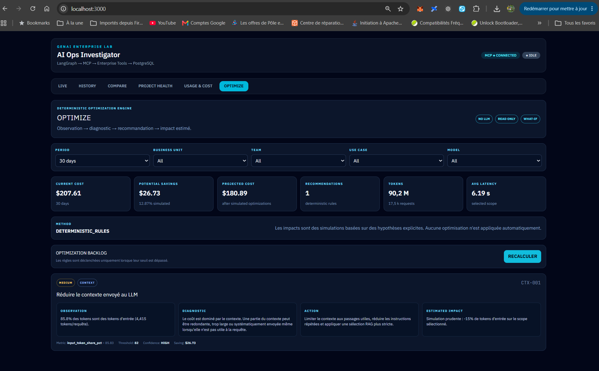
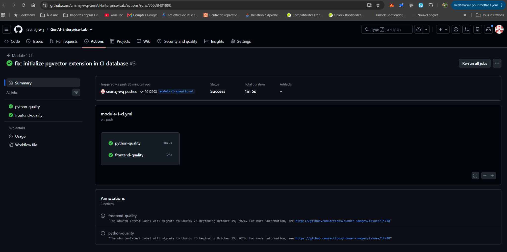
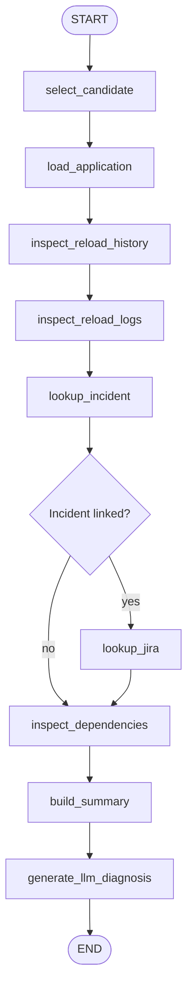
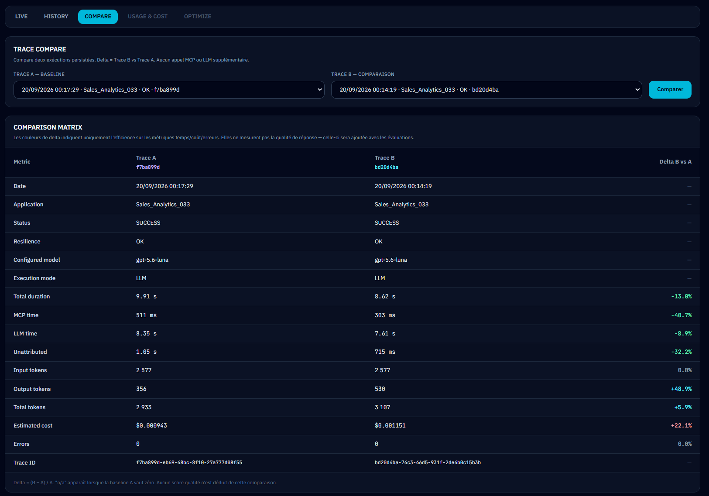
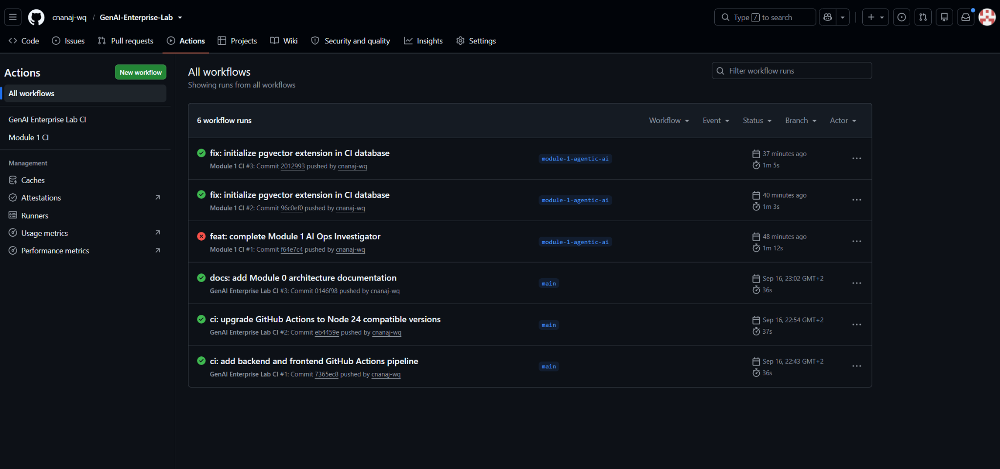

# GenAI Enterprise Lab

Production-oriented **GenAI Data Engineering** lab designed to build, test and industrialize enterprise Generative AI applications.

The repository is structured as a learning-by-building roadmap:

**learn → build → test → document → publish**

The goal is not to accumulate notebooks or disconnected proofs of concept. Each module produces a working, testable product with architecture, source code, observability and CI.

---

## Current status

| Module | Product | Status |
|---|---|---|
| Module 0 — Enterprise GenAI Technical Foundation | GenAI Enterprise Lab foundation | ✅ Complete |
| Module 1 — Agentic AI & MCP | **AI Ops Investigator** | ✅ Complete |
| Module 2 — Enterprise RAG | Enterprise Knowledge Copilot | 🔜 Next |
| Module 3 — Evaluation / Observability / LLMOps | GenAI Production Quality Control Tower | Planned |
| Module 4 — PromptOps / Guardrails | PromptOps Workbench | Planned |
| Module 5 — End-to-End AI Data Analyst | AI Data Analyst Platform | Planned |

Module 1 has passed both the **local quality gate** and a **real GitHub Actions CI run** on the `module-1-agentic-ai` branch.

---

# Module 1 — AI Ops Investigator

The AI Ops Investigator answers a concrete operational question such as:

> Why did `Sales_Analytics_033` fail during its last reload?

Instead of asking an LLM to guess, the system follows a controlled investigation workflow:

1. identify the failed reload;
2. load the application;
3. inspect reload history;
4. inspect logs;
5. search for the linked incident;
6. retrieve the Jira ticket when available;
7. inspect dependencies;
8. build a structured evidence summary;
9. ask the LLM to produce the diagnosis;
10. fall back to a deterministic diagnosis if the LLM is unavailable.

The system also exposes history, replay, trace comparison, GenAI FinOps, project health and deterministic optimization recommendations.

---

## Module 1 architecture



Detailed diagrams and implementation notes are available in:

- [`docs/module-1/README.md`](docs/module-1/README.md)
- [`docs/module-1/ARCHITECTURE.md`](docs/module-1/ARCHITECTURE.md)
- [`docs/module-1/RELEASE_NOTES.md`](docs/module-1/RELEASE_NOTES.md)

---

## Cockpit

The Next.js cockpit contains six active views:

- **LIVE** — real-time execution graph and SSE event stream;
- **HISTORY** — persisted investigations;
- **COMPARE** — trace-to-trace comparison;
- **PROJECT HEALTH** — Git, runtime and CI/CD health;
- **USAGE & COST** — GenAI FinOps analytics;
- **OPTIMIZE** — deterministic optimization recommendations.

### Live agent graph



### GenAI FinOps



### Optimize



---

# Core stack

## Application

- **Python 3.12**
- **FastAPI**
- **Pydantic / Pydantic Settings**
- **SQLAlchemy**
- **psycopg**

## Frontend

- **TypeScript**
- **Next.js 16**
- **React**
- **@xyflow/react**
- **Server-Sent Events**

## Agentic AI

- **LangGraph**
- **OpenAI Responses API**
- **Model Context Protocol**
- MCP client and MCP server
- read-only enterprise tools

## Data

- **PostgreSQL 18**
- **pgvector 0.8.6**
- SQL migrations
- synthetic enterprise-scale datasets

## Reliability

- request timeouts;
- bounded retries;
- exponential backoff;
- circuit breaker;
- deterministic LLM fallback;
- fault injection and recovery tests.

## Observability

Implemented in Module 1:

- trace;
- span;
- event;
- NODE / MCP / DATABASE / LLM / EVALUATION / ERROR span types;
- latency;
- token usage;
- estimated cost;
- execution breakdown;
- history and replay.

**Langfuse and OpenTelemetry are planned for Module 3; they are not presented as implemented in Module 1.**

## Quality and CI/CD

- **Ruff**
- **Pytest**
- **ESLint**
- **Next.js production build**
- **GitHub Actions**
- PostgreSQL + pgvector service container in CI

The final local quality gate validates:

```text
RUFF           PASS
PYTEST         PASS
ESLINT         PASS
NEXTJS_BUILD   PASS
```

The remote GitHub Actions workflow then repeats the validation on a clean runner.



---

# LangGraph workflow



All enterprise data access is routed through MCP tools except the internal candidate-discovery lookup used by the orchestration layer.

---

# MCP tools

The MCP server exposes six read-only tools:

- `get_application`
- `get_reload_history`
- `get_reload_logs`
- `get_incident`
- `get_jira_ticket`
- `check_dependencies`

MCP is treated as the standard interface between the agent and enterprise capabilities.

---

# Resilience

The project deliberately tests failure paths.

### MCP unavailable

```text
MCP call
   ↓
timeout
   ↓
retry
   ↓
exponential backoff
   ↓
circuit breaker
   ↓
controlled failure / telemetry
```

### LLM unavailable

The evidence-gathering workflow still completes. A deterministic fallback diagnosis is generated from structured facts already collected by the tools.

This avoids turning provider downtime into an ungrounded answer.

---

# History, replay and compare

**History** stores past investigations.

**Replay** reconstructs a previous execution from persisted traces, spans and events. It does not call MCP or the LLM again and therefore does not burn new tokens.

**Compare** allows two traces to be compared on:

- total duration;
- MCP duration;
- LLM duration;
- unattributed duration;
- input/output/total tokens;
- estimated cost;
- execution mode;
- error count.



---

# GenAI FinOps

The synthetic FinOps dataset models:

- 300 users;
- 12 teams;
- 6 business units;
- 5 use cases;
- 3 model tiers;
- 120 days of activity.

The cockpit can analyze cost and usage by business unit, team, use case and model.

Metrics include:

- total cost;
- input/output tokens;
- requests;
- active users;
- cost/request;
- tokens/request;
- success rate;
- retry rate;
- average latency.

---

# Deterministic optimization

`OPTIMIZE` converts measurable signals into an optimization backlog.

```text
Observation
   ↓
Diagnostic
   ↓
Recommendation
   ↓
Estimated impact
```

The first rule set covers:

- context pressure;
- premium model overuse;
- retries;
- latency;
- success rate;
- cost per request.

No LLM is used for these recommendations and no change is applied automatically.

---

# CI/CD lesson learned

The first remote Module 1 CI run failed even though the local quality gate was green.

Root cause:

- the local PostgreSQL database already had pgvector enabled;
- the GitHub Actions runner started from a fresh database;
- the Docker image contained pgvector, but the extension had not been activated in the database.

The fix was to make this dependency explicit in a migration:

```sql
CREATE EXTENSION IF NOT EXISTS vector;
```

The following CI runs passed.

That failure is intentionally documented because it demonstrates the value of CI: a clean runner exposes hidden dependencies that a developer workstation can accidentally mask.



---

# Run locally

## 1. PostgreSQL

```powershell
docker start genai-postgres
```

## 2. MCP server

```powershell
$Host.UI.RawUI.WindowTitle = "MCP SERVER"

cd C:\GenAI-Enterprise-Lab
.\.venv\Scripts\Activate.ps1

python -m apps.mcp.server
```

## 3. FastAPI

```powershell
$Host.UI.RawUI.WindowTitle = "FASTAPI SERVER"

cd C:\GenAI-Enterprise-Lab
.\.venv\Scripts\Activate.ps1

python -m uvicorn apps.api.app.main:app --reload --port 8000
```

## 4. Next.js

```powershell
$Host.UI.RawUI.WindowTitle = "NEXT.JS FRONTEND"

cd C:\GenAI-Enterprise-Lab\apps\web

npm run dev
```

Open:

```text
http://localhost:3000
```

---

# Quality gate

```powershell
$Host.UI.RawUI.WindowTitle = "MODULE 1 QUALITY GATE"

cd C:\GenAI-Enterprise-Lab
.\.venv\Scripts\Activate.ps1

python .\scripts\run_quality_gate.py
```

---

# Roadmap

## Module 2 — Enterprise RAG

Next product: **Enterprise Knowledge Copilot**.

Main topics:

- document ingestion;
- chunking;
- embeddings;
- pgvector;
- semantic retrieval;
- keyword search;
- hybrid retrieval;
- reranking;
- metadata filters;
- grounded answers;
- citations;
- retrieval evaluation.

## Module 3 — Evaluation / Observability / LLMOps

Planned:

- LLM-as-Judge;
- deterministic evaluators;
- RAG evaluation;
- prompt/model versioning;
- regression testing;
- OpenTelemetry;
- Langfuse;
- quality/cost/latency control tower;
- production incidents;
- canary and rollback;
- Grafana for operational observability.

---

## Portfolio principle

Every module should leave the repository in a better state than it found it:

**learn → build → test → document → publish**
