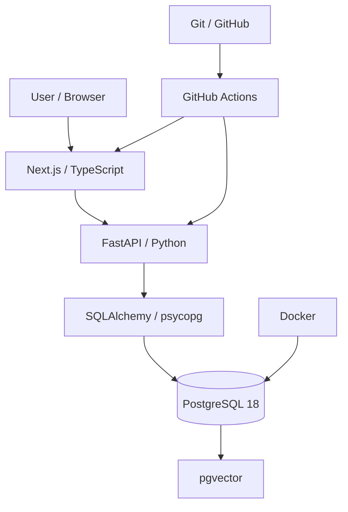

# Module 0 Architecture — GenAI Enterprise Lab

## Purpose

Module 0 establishes the technical foundation for the entire GenAI Enterprise Lab.

The objective is to create a reproducible, testable and production-oriented environment capable of supporting future modules covering:

- Agentic AI
- MCP
- RAG
- PromptOps
- LLM evaluation
- AI observability
- End-to-end GenAI applications

---

## High-Level Architecture



---

## Request Flow

The current application flow is:

```text
Browser
   │
   ▼
Next.js / TypeScript
   │
   ▼
FastAPI / Python
   │
   ▼
SQLAlchemy / psycopg
   │
   ▼
PostgreSQL 18
   │
   └── pgvector
```

The frontend requests the backend health endpoint.

FastAPI then connects to PostgreSQL and retrieves:

- API status
- Database status
- PostgreSQL version
- pgvector version

The result is displayed in the Next.js health dashboard.

---

## Frontend Layer

### Technology

- TypeScript
- React
- Next.js
- Tailwind CSS
- ESLint

### Responsibilities

The frontend is responsible for:

- Rendering the GenAI Enterprise Lab interface
- Displaying infrastructure health information
- Calling backend services
- Providing the future user interface for agents, RAG, evaluations and PromptOps
- Supporting server-side communication with FastAPI

Current entry point:

```text
apps/web/
```

Main page:

```text
apps/web/src/app/page.tsx
```

---

## Backend Layer

### Technology

- Python 3.12
- FastAPI
- Pydantic
- SQLAlchemy
- psycopg

### Responsibilities

The backend is responsible for:

- Exposing REST APIs
- Validating configuration and data
- Connecting to PostgreSQL
- Providing health checks
- Hosting future agentic workflows
- Hosting RAG services
- Exposing AI tools and MCP integrations
- Supporting structured LLM outputs

Current API location:

```text
apps/api/app/
```

Current endpoints:

```text
GET /
GET /health
```

---

## Configuration Management

Application configuration is handled through:

```text
Pydantic Settings
```

Current environment variables include:

```text
POSTGRES_DB
POSTGRES_USER
POSTGRES_PASSWORD
POSTGRES_PORT
```

Secrets are stored locally in:

```text
.env
```

The `.env` file is explicitly excluded from Git.

A public template is provided through:

```text
.env.example
```

This allows contributors to recreate the environment without exposing credentials.

---

## Database Layer

### Technology

- PostgreSQL 18
- pgvector 0.8.6

### Responsibilities

PostgreSQL will serve as the main enterprise data layer for:

- Structured business data
- Application state
- Synthetic datasets
- Incident data
- Agent tool queries
- RAG metadata
- Evaluation datasets

pgvector adds vector storage and similarity search capabilities for future RAG workflows.

Current database:

```text
genai_lab
```

---

## Docker Infrastructure

PostgreSQL and pgvector run inside Docker.

Current Docker image:

```text
pgvector/pgvector:0.8.6-pg18
```

Docker provides:

- Reproducible infrastructure
- Isolated services
- Consistent environments
- Easier onboarding
- Reduced host machine dependencies

Current infrastructure file:

```text
infra/docker-compose.yml
```

Persistent PostgreSQL data is stored using a Docker volume.

---

## Database Initialization

Database initialization scripts are stored in:

```text
database/init/
```

Current initialization includes:

```sql
CREATE EXTENSION IF NOT EXISTS vector;
```

This ensures pgvector is automatically available when the database is created.

---

## Health Check Architecture

The current health endpoint validates the application stack.

```text
GET /health
```

Response example:

```json
{
  "api": "healthy",
  "database": "healthy",
  "postgresql": "18.6",
  "pgvector": "0.8.6"
}
```

The endpoint verifies:

- FastAPI availability
- PostgreSQL connectivity
- PostgreSQL version
- pgvector extension availability

---

## Automated Testing

### Backend

Backend tests use:

- Pytest
- FastAPI TestClient

Current automated tests validate:

- Root endpoint
- Health endpoint
- Database connectivity
- PostgreSQL version availability
- pgvector availability

Tests are located in:

```text
tests/
```

---

## Code Quality

### Python

Python quality checks are performed with:

```text
Ruff
```

Ruff currently validates:

- Python syntax
- Import order
- Common code issues
- Style rules

Configuration:

```text
pyproject.toml
```

### Frontend

Frontend quality checks use:

```text
ESLint
TypeScript
Next.js production build
```

The production build ensures that the frontend is not only valid in development mode but can also compile successfully for production.

---

## Continuous Integration

GitHub Actions automatically validates the application.

Workflow:

```text
.github/workflows/ci.yml
```

The CI pipeline is triggered on:

```text
push → main
pull_request → main
```

---

## Backend CI Job

The backend pipeline creates a fresh environment containing:

```text
Ubuntu
Python 3.12
PostgreSQL 18
pgvector
```

It then executes:

```text
Checkout repository
        ↓
Setup Python
        ↓
Install dependencies
        ↓
Enable pgvector
        ↓
Ruff
        ↓
Pytest
```

A successful pipeline confirms that the backend can be recreated independently from the developer workstation.

---

## Frontend CI Job

The frontend pipeline creates a fresh Node.js environment.

Current runtime:

```text
Node.js 24
```

Pipeline:

```text
Checkout repository
        ↓
Setup Node.js
        ↓
npm ci
        ↓
ESLint
        ↓
Next.js production build
```

The CI therefore validates both code quality and production compilation.

---

## Git Strategy

The project uses Git for incremental version control.

Current main branch:

```text
main
```

Development changes are tracked through explicit commits such as:

```text
chore: initialize GenAI Enterprise Lab
feat: add PostgreSQL 18 and pgvector infrastructure
feat: add FastAPI backend with PostgreSQL health check
feat: add Next.js health dashboard connected to FastAPI
ci: add backend and frontend GitHub Actions pipeline
ci: upgrade GitHub Actions to Node 24 compatible versions
```

This provides a readable technical history of the platform evolution.

---

## Repository Structure

```text
GenAI-Enterprise-Lab/
│
├── .github/
│   └── workflows/
│
├── agents/
│   ├── graphs/
│   ├── prompts/
│   └── tools/
│
├── apps/
│   ├── api/
│   └── web/
│
├── data/
│   ├── generators/
│   └── samples/
│
├── database/
│   ├── indexes/
│   ├── init/
│   ├── migrations/
│   └── queries/
│
├── docs/
│   └── architecture/
│
├── evals/
├── infra/
├── observability/
├── rag/
│   ├── ingestion/
│   └── retrieval/
│
├── tests/
│
├── .env.example
├── .gitignore
├── pyproject.toml
├── requirements.txt
├── requirements-dev.txt
├── requirements.lock.txt
└── README.md
```

---

## Security Principles

The foundation already applies several security rules:

- Secrets are never committed to Git
- `.env` is ignored
- GitHub commit email privacy is enabled
- PostgreSQL credentials are injected through environment variables
- CI uses dedicated non-production credentials
- Infrastructure is isolated through Docker
- Application configuration is separated from code

Future modules will extend this with:

- Agent tool permissions
- MCP security boundaries
- Prompt injection protection
- RAG source validation
- Human-in-the-loop controls
- Audit logging

---

## Design Decisions

### Why PostgreSQL?

PostgreSQL was selected because it can support:

- Structured business data
- SQL analytics
- Large synthetic datasets
- JSON data
- Full-text search
- Vector search through pgvector

This allows the lab to avoid introducing unnecessary database technologies too early.

### Why pgvector?

pgvector allows RAG capabilities to remain close to the relational data layer.

It supports:

- Embeddings
- Vector similarity
- Future semantic retrieval
- Hybrid data architectures

### Why FastAPI?

FastAPI provides:

- Strong Python typing
- High performance
- OpenAPI documentation
- Async support
- Pydantic integration
- A suitable foundation for AI services

### Why Next.js?

Next.js provides:

- TypeScript support
- React UI capabilities
- Server-side rendering
- Server-side API calls
- Production builds
- A strong application layer for future GenAI interfaces

### Why Docker?

Docker guarantees reproducibility between:

- Local development
- CI
- Future deployment environments

### Why GitHub Actions?

GitHub Actions allows every change to be validated independently from the local workstation.

This reduces:

- Environment drift
- Manual validation
- Broken production builds
- Undetected regressions

---

## Module 0 Validation

Module 0 is considered complete when:

- [x] Git repository initialized
- [x] PostgreSQL 18 running in Docker
- [x] pgvector enabled
- [x] Python virtual environment configured
- [x] FastAPI backend operational
- [x] PostgreSQL connectivity validated
- [x] Automated backend tests operational
- [x] Ruff validation operational
- [x] TypeScript / Next.js frontend operational
- [x] Frontend connected to FastAPI
- [x] Production Next.js build operational
- [x] GitHub repository synchronized
- [x] GitHub Actions backend CI successful
- [x] GitHub Actions frontend CI successful
- [x] Node.js 24 compatible GitHub Actions
- [x] Architecture documented

---

## Next Step

The technical foundation is now ready for:

# Module 1 — Agentic AI & MCP

The next module will introduce:

```text
LLM
 ↓
Agent
 ↓
Tool selection
 ↓
MCP
 ↓
PostgreSQL / Logs / Enterprise APIs
 ↓
Structured diagnosis
```

The first production-oriented AI system will be:

**AI Ops Investigator**
