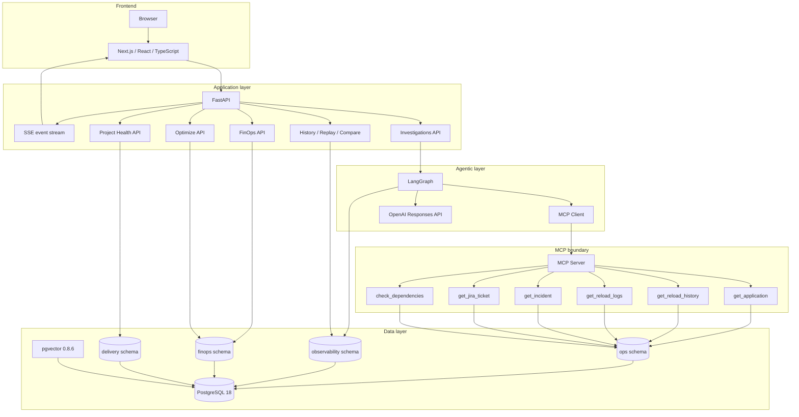
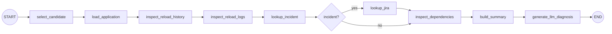
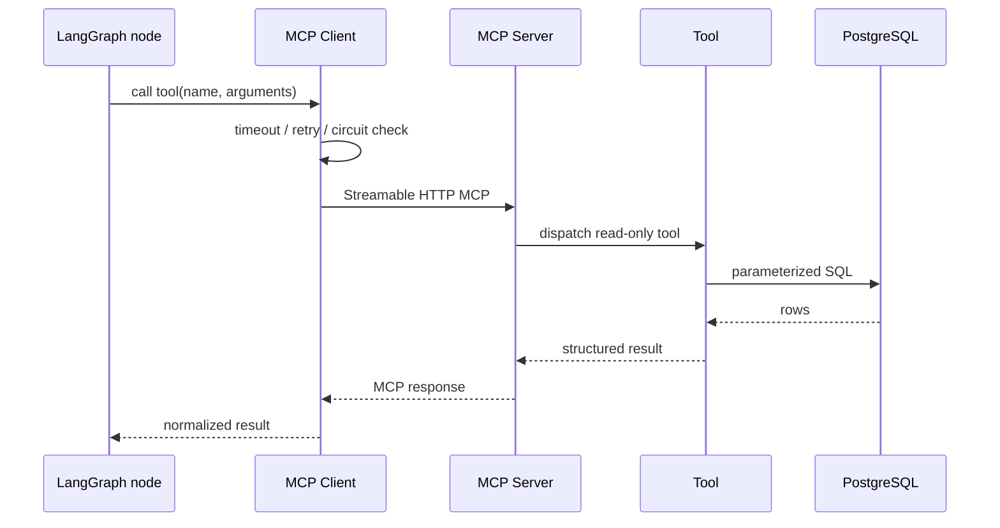
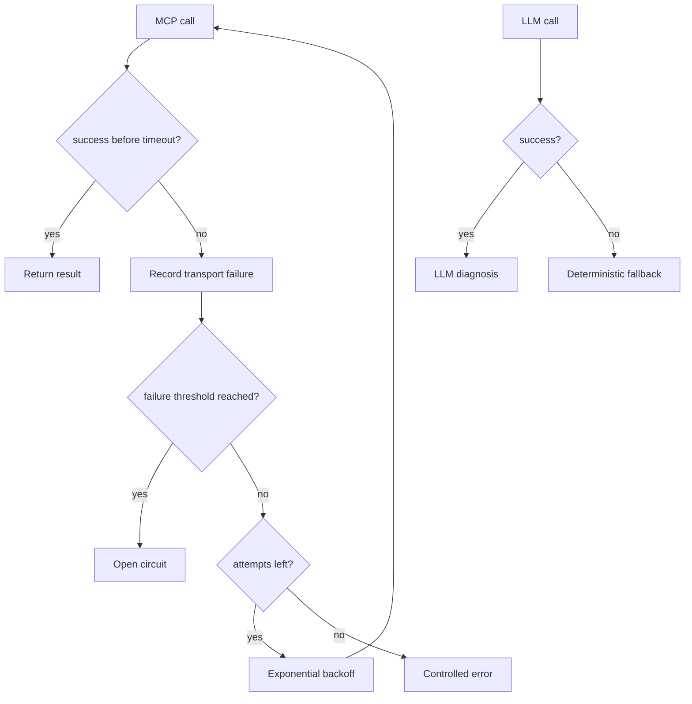
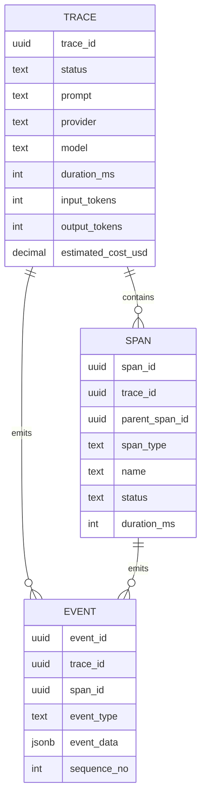
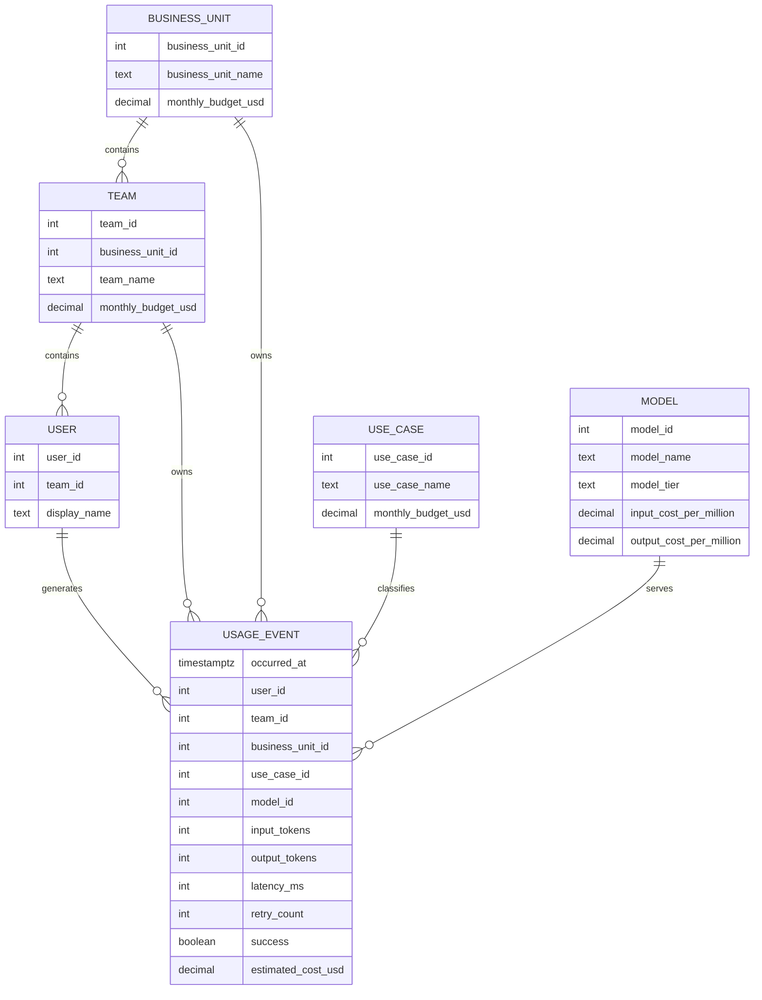
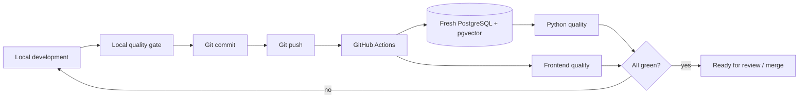

# Module 1 Architecture

## System architecture

---

## LangGraph execution

---

## MCP request path

---

## Resilience architecture

---

## Observability model

---

## FinOps model

---

## CI/CD flow

The first remote Module 1 run followed the `no` path because pgvector had not been activated inside the fresh CI database. The missing dependency was converted into an explicit migration, then the pipeline passed.
