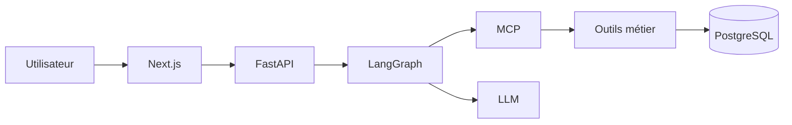

# Article LinkedIn — Module 1

## J’ai construit un agent IA capable d’enquêter sur un incident… mais le plus intéressant n’est pas le LLM

Quand on entend “agent IA”, on imagine souvent un modèle qui réfléchit tout seul et appelle quelques outils.

Dans un environnement d’entreprise, ce n’est pas suffisant.

Un système agentique utile doit savoir :

- où chercher ;
- dans quel ordre chercher ;
- quelles données il a le droit de lire ;
- comment prouver ce qu’il avance ;
- quoi faire si un service tombe ;
- combien son exécution coûte ;
- comment rejouer une investigation ;
- comment comparer deux runs ;
- et surtout : comment vérifier qu’une modification n’a rien cassé.

C’est exactement ce que j’ai voulu construire dans le **Module 1 de mon GenAI Enterprise Lab**.

Le produit s’appelle **AI Ops Investigator**.

Sa question de départ paraît simple :

> Pourquoi l’application `Sales_Analytics_033` a-t-elle échoué lors de son dernier reload ?

Mais derrière cette question, il y a toute une architecture.

---

# 1. Explication simple : comme une enquête policière

Imaginez un enfant de 10 ans qui doit comprendre pourquoi une machine s’est arrêtée.

Il ne doit pas commencer par inventer une réponse.

Il doit :

1. regarder quelle machine est concernée ;
2. vérifier ce qui s’est passé juste avant la panne ;
3. lire les messages d’erreur ;
4. regarder s’il existe un incident ;
5. vérifier si quelqu’un a ouvert un ticket ;
6. contrôler les dépendances ;
7. rassembler les preuves ;
8. seulement ensuite expliquer la cause.

Mon agent fonctionne de cette façon.

Le LLM n’est donc pas “le système”.

Le LLM est seulement **le cerveau qui formule l’explication finale**.

Autour de lui, il faut tout le reste.

---

# 2. Sous le capot : l’architecture

Dans mon projet :

- **Next.js** = le cockpit visible par l’utilisateur ;
- **FastAPI** = la porte d’entrée backend ;
- **LangGraph** = le chef d’orchestre ;
- **MCP** = la prise standard qui permet à l’agent d’utiliser les outils ;
- **PostgreSQL** = la mémoire métier ;
- **OpenAI** = le moteur de génération du diagnostic ;
- **traces / spans / events** = les capteurs qui enregistrent ce qui se passe ;
- **GitHub Actions** = le robot qui vérifie que le projet fonctionne encore après une modification.

Architecture logique :



---

# 3. LangGraph : le système nerveux de l’enquête

Le workflow n’est pas un simple prompt.

Il est explicite :

```text
START
  ↓
select_candidate
  ↓
load_application
  ↓
inspect_reload_history
  ↓
inspect_reload_logs
  ↓
lookup_incident
  ↓
lookup_jira si nécessaire
  ↓
inspect_dependencies
  ↓
build_summary
  ↓
generate_llm_diagnosis
  ↓
END
```

Cette structure a un avantage majeur : on sait exactement **où l’agent se trouve** et **pourquoi il passe à l’étape suivante**.

Cela rend l’exécution beaucoup plus observable qu’un gros prompt opaque.

---

# 4. MCP : pourquoi ajouter encore une couche ?

On pourrait laisser LangGraph appeler directement des fonctions Python.

Mais cela crée un couplage très fort.

J’ai donc placé les capacités métier derrière MCP.

L’agent dispose de six outils en lecture seule :

- `get_application`
- `get_reload_history`
- `get_reload_logs`
- `get_incident`
- `get_jira_ticket`
- `check_dependencies`

Pour l’expliquer simplement :

> MCP joue le rôle d’une prise standard.

L’agent connaît la prise et le contrat. Il n’a pas besoin de connaître tout le câblage interne de chaque système métier.

---

# 5. Une règle : les preuves avant le texte

Je ne voulais surtout pas construire un agent qui reçoit une question et “réfléchit” directement sur toute la base.

Le workflow collecte d’abord des faits structurés.

Ensuite seulement le LLM reçoit un paquet de preuves limité.

C’est important pour trois raisons :

- moins d’ambiguïté ;
- moins de contexte inutile ;
- meilleure traçabilité.

Le LLM explique les preuves. Il ne remplace pas les preuves.

---

# 6. J’ai aussi voulu voir l’agent travailler

Un agent qui travaille mais dont on ne voit rien est difficile à exploiter.

J’ai donc construit un cockpit temps réel avec :

- le graphe LangGraph ;
- les appels MCP ;
- les spans database ;
- l’appel LLM ;
- le flux d’événements SSE ;
- la durée de chaque bloc ;
- le nombre de tokens ;
- le coût estimé.

Capture recommandée : `01-live-agent-graph.png`

---

# 7. Trace, Span, Event : trois mots importants

Version simple :

- **Trace** = tout le trajet d’une investigation ;
- **Span** = une étape du trajet ;
- **Event** = quelque chose qui arrive pendant une étape.

Exemple :

```text
TRACE
 ├─ NODE select_candidate
 ├─ NODE load_application
 │   └─ MCP get_application
 ├─ NODE inspect_reload_logs
 │   └─ MCP get_reload_logs
 └─ LLM diagnosis
```

Cette instrumentation permet ensuite de calculer :

- durée totale ;
- durée MCP ;
- durée LLM ;
- tokens ;
- coût ;
- erreurs ;
- retries ;
- fallback.

---

# 8. Premier vrai test de résilience : MCP tombe

J’ai volontairement arrêté MCP.

Le premier résultat a révélé un problème intéressant.

J’avais bien ajouté des retries autour des appels aux outils…

…mais la panne arrivait **avant**, au moment de créer la session MCP.

Donc mes retries ne protégeaient pas le bon niveau.

Correction :

- timeout de connexion ;
- retry de connexion ;
- backoff exponentiel ;
- circuit breaker ;
- télémétrie dédiée.

Puis nouveau test.

Cette fois le système a échoué de manière contrôlée et observable.

C’est une leçon importante :

> mettre un retry quelque part ne signifie pas que le système est résilient.

Il faut placer la résilience au niveau où la panne peut réellement apparaître.

---

# 9. Deuxième test : le LLM tombe

J’ai ensuite simulé une panne du provider LLM.

Cette fois je ne voulais pas perdre toute l’investigation.

Les outils avaient déjà collecté :

- le reload en échec ;
- les codes d’erreur ;
- l’incident ;
- le ticket Jira ;
- les dépendances.

J’ai donc ajouté un **fallback déterministe**.

En cas de panne LLM, le système produit un diagnostic limité aux faits déjà collectés.

Il précise explicitement qu’il s’agit d’un mode dégradé.

Pas de nouveau token.

Pas d’invention.

---

# 10. History et Replay

J’ai ensuite ajouté une mémoire opérationnelle.

**History** permet de retrouver les anciennes investigations.

**Replay** permet de reconstruire une ancienne exécution à partir des traces stockées.

Et surtout :

> Replay ne rappelle ni MCP ni le LLM.

Il ne brûle donc aucun nouveau token.

C’est la différence entre “refaire l’enquête” et “rejouer ce qui s’est réellement passé”.

---

# 11. Compare : plus rapide ne veut pas dire meilleur

J’ai ajouté une vue Compare pour mettre deux traces face à face.

Je peux comparer :

- durée ;
- MCP ;
- LLM ;
- tokens input ;
- tokens output ;
- coût ;
- erreurs ;
- mode normal / fallback / failed.

Un test m’a donné un résultat particulièrement intéressant :

un run était plus rapide mais plus cher.

Cela montre pourquoi il faut éviter les conclusions simplistes.

**Faster ≠ cheaper.**

Et plus important encore :

**cheaper ≠ better quality.**

La qualité sera évaluée dans un module dédié.

---

# 12. GenAI FinOps : le token burn seul ne suffit pas

J’ai ensuite voulu dépasser le simple compteur de tokens.

J’ai créé un dataset FinOps synthétique avec :

- 300 utilisateurs ;
- 12 équipes ;
- 6 Business Units ;
- 5 use cases ;
- 3 modèles ;
- 120 jours d’activité.

La hiérarchie devient :

```text
Utilisateur
  ↓
Équipe
  ↓
Business Unit
  ↓
Use Case
  ↓
Modèle
  ↓
Trace
  ↓
Tokens
  ↓
Coût
```

Le cockpit calcule :

- coût total ;
- requêtes ;
- tokens input/output ;
- utilisateurs actifs ;
- coût/requête ;
- tokens/requête ;
- success rate ;
- retry rate ;
- latence.

Capture recommandée : `04-finops.png`

---

# 13. OPTIMIZE : je ne voulais pas d’un LLM qui donne des conseils vagues

Dernière étape du cockpit : **OPTIMIZE**.

Mais je n’ai pas demandé à un LLM :

> “Comment optimiser mes coûts ?”

J’ai construit un moteur de règles déterministes.

Exemple :

```text
Observation
85,8 % des tokens sont des tokens d’entrée

Diagnostic
Le contexte domine le coût

Action
Réduire le contexte et mieux sélectionner les passages utiles

Impact simulé
-15 % de tokens d’entrée
```

Le moteur dispose de règles sur :

- la pression contexte ;
- l’usage du modèle premium ;
- les retries ;
- la latence ;
- le taux de succès ;
- le coût/requête.

Aucune modification n’est appliquée automatiquement.

C’est du **WHAT-IF**.

Capture recommandée : `05-optimize.png`

---

# 14. Et puis le CI a cassé alors que tout était vert en local

C’est probablement l’étape la plus importante du projet.

Mon Quality Gate local était entièrement vert :

```text
Ruff          PASS
Pytest        PASS
ESLint        PASS
Next.js build PASS
```

Je pousse sur GitHub.

Le premier GitHub Actions échoue.

Pourquoi ?

Le test de santé attend :

```text
pgvector = 0.8.6
```

Mais sur le runner GitHub :

```text
pgvector = not_installed
```

Pourtant j’utilisais bien une image Docker pgvector.

Le problème était ailleurs.

Sur ma machine, l’extension avait déjà été activée dans PostgreSQL.

Sur le runner GitHub, la base était complètement neuve.

L’image Docker contenait pgvector…

…mais personne n’avait exécuté :

```sql
CREATE EXTENSION vector;
```

Mon environnement local cachait donc une dépendance implicite.

---

# 15. Pourquoi le CI est utile

J’ai corrigé cela avec une migration explicite :

```sql
CREATE EXTENSION IF NOT EXISTS vector;
```

Nouveau push.

Nouveau pipeline.

Résultat :

```text
python-quality    SUCCESS
frontend-quality  SUCCESS
Module 1 CI       SUCCESS
```

Capture recommandée : `06-github-actions-success.png`

Cette petite panne résume très bien la valeur du CI :

> le CI ne sert pas seulement à “faire tourner des tests automatiquement”.
>
> Il sert aussi à vérifier que le projet peut réellement fonctionner sur une machine propre, sans dépendre de l’état historique du PC du développeur.

---

# 16. Ce que ce module m’a réellement appris

Au départ, le sujet était “Agentic AI + MCP”.

À l’arrivée, le projet m’a surtout appris qu’un agent de production est un **système distribué**.

Le LLM n’est qu’une pièce.

Il faut aussi :

- orchestration ;
- outils ;
- contrats ;
- données ;
- sécurité ;
- observabilité ;
- résilience ;
- FinOps ;
- optimisation ;
- tests ;
- CI/CD.

Et dès qu’une de ces briques manque, on quitte rapidement le monde de la démo pour entrer dans celui des incidents.

---

# 17. Stack finale du Module 1

- Python 3.12
- FastAPI
- Pydantic
- SQLAlchemy
- psycopg
- PostgreSQL 18
- pgvector
- LangGraph
- MCP client/server
- OpenAI Responses API
- Next.js
- React
- TypeScript
- SSE
- Ruff
- Pytest
- ESLint
- Git
- GitHub Actions
- Docker

---

# 18. Prochaine étape

Le prochain module sera consacré au **RAG d’entreprise**.

Objectif :

construire un **Enterprise Knowledge Copilot** capable de :

- ingérer des documents ;
- chunker ;
- générer des embeddings ;
- utiliser pgvector ;
- faire du retrieval sémantique ;
- ajouter une recherche keyword ;
- construire du hybrid search ;
- reranker ;
- filtrer par metadata ;
- citer ses sources ;
- mesurer la qualité du retrieval.

Même règle :

**learn → build → test → document → publish**

#AgenticAI #MCP #LangGraph #GenAIEngineering #LLMOps
