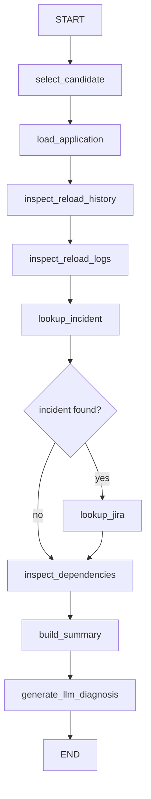
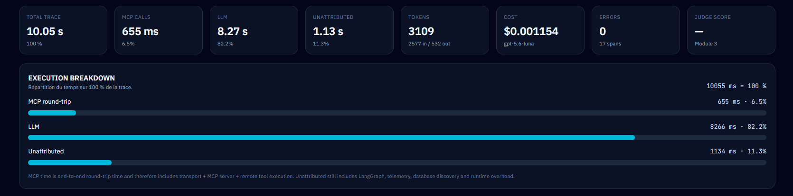

# Module 1 — AI Ops Investigator

## 1. Business problem

Operational BI platforms generate reload logs, incidents, Jira tickets, dependency metadata and application records. During an incident, an engineer often has to move manually across these systems before being able to answer a simple question:

> Why did this application fail?

The AI Ops Investigator turns that manual investigation into a controlled agentic workflow.

The objective is not to let an LLM improvise. The objective is to collect evidence first, preserve traceability, then let the LLM explain the evidence.

---

## 2. Product capabilities

The finished Module 1 product contains six cockpit views.

### LIVE

Real-time agent execution with:

- LangGraph nodes;
- MCP tool calls;
- database activity;
- LLM activity;
- SSE event stream;
- execution breakdown;
- structured diagnosis.


### HISTORY

Lists persisted investigations with status, application, resilience mode, model, duration, tokens and cost.

### COMPARE

Compares two persisted traces without implying that one trace is automatically “better”.


### PROJECT HEALTH

Combines:

- Git branch and commit;
- working-tree state;
- local/remote sync;
- runtime services;
- quality checks;
- CI history;
- alerts.

### USAGE & COST

Enterprise GenAI FinOps view.


### OPTIMIZE

Deterministic recommendation engine.


---

## 3. Investigation workflow

The workflow is intentionally sequential where evidence depends on a previous result.



The agent has explicit state. Each node reads or enriches that state.

---

## 4. Why MCP exists here

Without MCP, LangGraph could call local Python functions directly.

That would work technically, but it would bind the agent tightly to one implementation.

MCP introduces a standard boundary:

```text
Agent
  ↓
MCP client
  ↓
MCP protocol
  ↓
MCP server
  ↓
Enterprise tool
```

A useful analogy is a standardized electrical socket: the agent does not need to know the internal wiring of every enterprise capability.

The server exposes six read-only tools:

| Tool | Purpose |
|---|---|
| `get_application` | Load application metadata |
| `get_reload_history` | Inspect reload history |
| `get_reload_logs` | Retrieve technical reload logs |
| `get_incident` | Retrieve linked incident |
| `get_jira_ticket` | Retrieve related Jira record |
| `check_dependencies` | Inspect application dependencies |

The tools are parameterized and read-only.

---

## 5. Evidence before generation

The main design rule is:

> structured evidence first, natural-language diagnosis second.

The LLM does not directly browse the whole database.

It receives a bounded evidence payload built from the outputs of the investigation workflow.

This reduces ambiguity and makes the final answer traceable.

---

## 6. Observability model

Module 1 implements its own trace/span/event persistence.

### Trace

A trace represents one complete investigation.

It stores, among other fields:

- status;
- prompt;
- provider/model;
- duration;
- input/output tokens;
- estimated cost;
- errors.

### Span

A span represents one step of the execution.

Span types include:

- `NODE`
- `MCP`
- `DATABASE`
- `LLM`
- `EVALUATION`
- `OTHER`

### Event

An event records a fact that happened during the run, for example:

- trace started;
- span started;
- MCP retry scheduled;
- circuit opened;
- fallback used;
- diagnosis ready;
- trace finished.

This is enough to support the live cockpit, history, replay and execution breakdown.



---

## 7. Reliability

### MCP resilience

The MCP client implements:

- per-call timeout;
- bounded retry count;
- exponential backoff;
- circuit breaker;
- retry telemetry.

A transport failure can therefore be distinguished from an application-level tool error.

### LLM resilience

If the LLM provider fails, the project does not discard the evidence already collected.

Instead it creates a deterministic fallback diagnosis from:

- failed reload;
- root error codes;
- linked incident;
- Jira ticket;
- known structured facts.

The fallback explicitly states that it was produced without the LLM.

---

## 8. History and replay

History is not just a UI convenience. It turns observability into operational memory.

Replay reconstructs an old run from stored observability data:

```text
trace
 + spans
 + events
 + summary
 + diagnosis
 = replay
```

Replay does not call the LLM or MCP again.

That means:

- no new model cost;
- no new token usage;
- no dependence on current provider availability;
- reproducible analysis of what actually happened.

---

## 9. Compare

Two runs can be compared across:

- execution status;
- resilience mode;
- configured model;
- total duration;
- MCP duration;
- LLM duration;
- unattributed duration;
- tokens;
- cost;
- errors.

A faster run is not automatically a better run.

A cheaper fallback is not automatically a higher-quality answer.

Quality evaluation is intentionally deferred to the dedicated evaluation module.

---

## 10. GenAI FinOps

The FinOps model introduces the hierarchy:

```text
Business Unit
   ↓
Team
   ↓
User
   ↓
Use Case
   ↓
Model
   ↓
Usage Event
```

The synthetic enterprise dataset contains:

- 6 business units;
- 12 teams;
- 300 users;
- 5 use cases;
- 3 model tiers;
- 120 days of activity.

The dashboard can filter the selected scope and calculate:

- cost;
- input/output tokens;
- requests;
- active users;
- cost/request;
- tokens/request;
- success rate;
- retry rate;
- latency.

The objective is to move from “how many tokens did we burn?” to “where, for whom, and for what use case did we spend them?”

---

## 11. OPTIMIZE

OPTIMIZE is deliberately not an LLM advisor.

It is a deterministic rule engine.

```text
measured metric
     ↓
explicit threshold
     ↓
rule
     ↓
recommendation
     ↓
what-if impact
```

Rules include:

| Rule | Signal |
|---|---|
| `CTX-001` | Excessive input-token/context share |
| `ROUTE-001` | Premium model overuse |
| `REL-001` | Retry rate too high |
| `LAT-001` | Latency too high |
| `QUAL-001` | Success rate below target |
| `COST-001` | Cost per request too high |

No recommendation is automatically applied.

---

## 12. CI/CD

The local quality gate runs:

```text
Ruff
Pytest
ESLint
Next.js build
```

The same idea is repeated remotely by GitHub Actions on a fresh environment.

### Why the first remote CI failed

The local environment already had pgvector activated.

The fresh GitHub Actions PostgreSQL database did not.

The Docker image contained pgvector binaries, but the database extension itself had not been created.

The health test therefore returned:

```text
pgvector = not_installed
```

The repository was fixed by adding an explicit database migration:

```sql
CREATE EXTENSION IF NOT EXISTS vector;
```

The next CI runs passed.


This is one of the most important lessons of the module:

> a clean CI runner is useful precisely because it does not inherit the accidental state of a developer workstation.

---

## 13. What was learned through failures

The module intentionally keeps the engineering story rather than hiding it.

Important examples:

- a direct browser GET on the MCP Streamable HTTP endpoint returned “Missing session ID”; this was protocol behavior, not a dead server;
- MCP tool retries initially did not protect MCP session creation, so connection resilience had to be added one layer earlier;
- LLM recovery initially appeared broken because a stale FastAPI process still had an old environment variable;
- a FinOps query used an ambiguous `day` alias and failed at runtime;
- frontend quality checks found React effect, JSX escaping and TypeScript inference issues;
- Windows CP1252 decoding broke the first quality-gate runner;
- the remote CI exposed the implicit pgvector initialization dependency.

Each failure produced a concrete correction and a retest.

---

## 14. Final validation

### Local

```text
RUFF             PASS
PYTEST           PASS
ESLINT           PASS
NEXTJS_BUILD     PASS
Project Health   RECORDED
Overall          PASS
```

### GitHub Actions

```text
python-quality    SUCCESS
frontend-quality  SUCCESS
Module 1 CI       SUCCESS
```


---

## 15. What comes next

Module 2 will reuse the same foundation for an **Enterprise Knowledge Copilot** with:

- ingestion;
- chunking;
- embeddings;
- pgvector;
- semantic search;
- keyword search;
- hybrid retrieval;
- reranking;
- source citations;
- retrieval evaluation.
